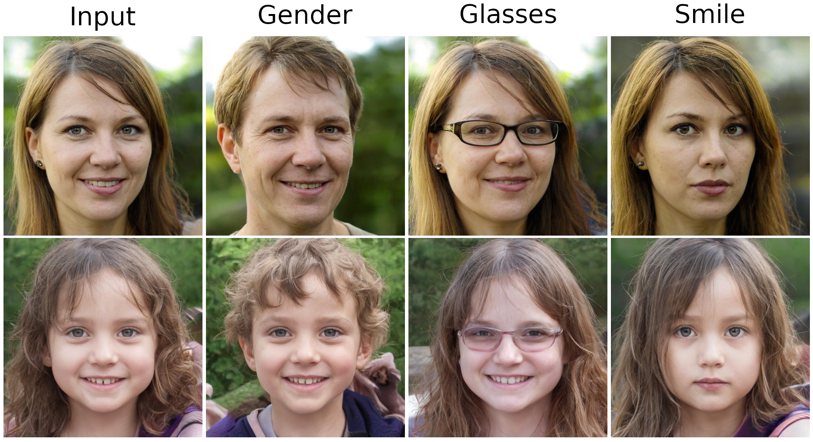

<table><tr>
<td> 
  

    
     
    <em style="color: grey">Attributes manipulation performed by PluGeN using the StyleGAN backbone.</em>
  
 
</td>
</tr></table>

## Abstract 

> Modern generative models achieve excellent quality in a variety of tasks including image or text generation and chemical molecule modeling. However, existing methods often lack the essential ability to generate examples with requested properties, such as the age of the person in the photo or the weight of the generated molecule. Incorporating such additional conditioning factors would require rebuilding the entire architecture and optimizing the parameters from scratch. Moreover, it is difficult to disentangle selected attributes so that to perform edits of only one attribute while leaving the others unchanged. To overcome these limitations we propose PluGeN (Plugin Generative Network), a simple yet effective generative technique that can be used as a plugin to pre-trained generative models. The idea behind our approach is to transform the entangled latent representation using a flow-based module into a multi-dimensional space where the values of each attribute are modeled as an independent one-dimensional distribution. In consequence, PluGeN can generate new samples with desired attributes as well as manipulate labeled attributes of existing examples. Due to the disentangling of the latent representation, we are even able to generate samples with rare or unseen combinations of attributes in the dataset, such as a young person with gray hair, men with make-up, or women with beards. We combined PluGeN with GAN and VAE models and applied it to conditional generation and manipulation of images and chemical molecule modeling. Experiments demonstrate that PluGeN preserves the quality of backbone models while adding the ability to control the values of labeled attributes.

## Intuition

<table>
<tr>
<td> 
  

    
     
    <em style="color: grey">(a) Factorization of true data distribution.</em>
  
 
</td>
<td> 
  

    
     
    <em style="color: grey">(b) Distribution covered by PluGeN.</em>
  
 
</td>
</tr>
<tr>  
    <td colspan="2">
    

        <em style="color: grey">PluGeN factorizes true data distribution into components (marginal distributions) related to labeled attributes, see (a), and allows for describing unexplored regions of data (uncommon combinations of labels) by sampling from independent components, see (b). In the case illustrated here, PluGeN constructs pictures of men with make-up or women with beards, although such examples rarely (or never) appear in the training set.</em>
    

    </td>
</tr>
</table>

## Method

<table><tr>
<td> 
  

    
     
    <em style="color: grey">PluGeN maps the entangled latent space Z of pretrained generative models using invertible normalizing flow into a separate space, where labeled attributes are modeled using independent 1-dimensional distributions. By manipulating label variables in this space, we fully control the generation process.</em>
  
 
</td>
</tr></table>

## Results

### Attribute manipulation 

GAN
VAE

### Conditional generation

VAE

### Chemical molecules modeling

<table>
<tr>
<td> 
  

    
     
    <em style="color: grey">(a)  Molecules decoded from path.</em>
  
 
</td>
<td> 
  

    
     
    <em style="color: grey">(b) LogP of presented molecules.</em>
  
 
</td>
</tr>
<tr>  
    <td colspan="2">
    

        <em style="color: grey">: Molecules obtained by the model during an optimization phase (a), and their LogP (b).</em>
    

    </td>
</tr>
</table>
